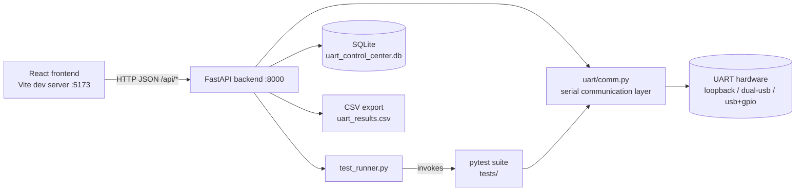
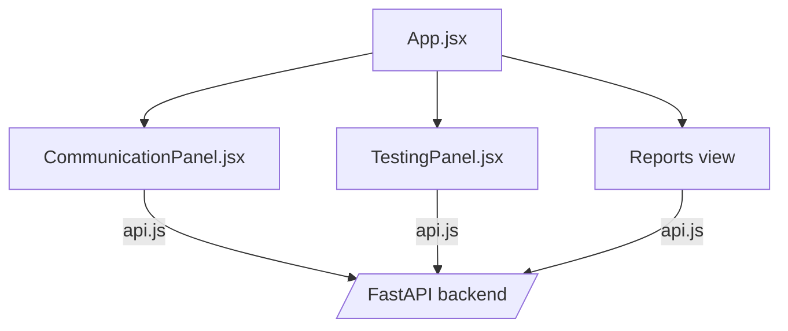

# High-Level Design (HLD)

## 1. Overall Architecture
UART Control Center is a three-tier local application: a React frontend, a FastAPI backend, and a hardware/data layer consisting of the serial UART link and a SQLite database. The backend also shells out to `pytest` to execute the validation suite and parses the results back into the database.

## 2. Module Descriptions

| Module | Responsibility |
|---|---|
| `frontend/` | React + Vite single-page app. Lets a user pick ports, send/receive data, trigger test runs, and browse history. |
| `backend/app.py` | FastAPI app — defines all HTTP routes listed in the API summary. |
| `backend/services.py` | Business logic behind the routes: talking to `uart/comm.py`, building responses, reading/writing the database. |
| `backend/models.py` | Data models — request/response schemas and/or database models used by the API layer. |
| `backend/test_runner.py` | Starts pytest runs in the background, tracks run status, and stores results. |
| `uart/comm.py` | Reusable UART library — open/configure ports, send/receive, duplex exchange, chunking, CRC framing, sequence numbering, throughput/timing helpers. |
| `tests/` | Pytest suite (7 scenario groups, 31 test functions, 90 total cases) validating the UART layer against real hardware. |
| `uart_control_center.db` | SQLite database storing test runs, test results, saved profiles, and communication logs. |

## 3. Component Interaction

**Manual communication flow:**
1. User selects TX/RX ports and enters data in the Communication panel.
2. Frontend calls `POST /api/communicate`.
3. Backend (`services.py`) uses `uart/comm.py` to open the ports, send the data, and read the response.
4. Result and a communication log entry are returned to the frontend and stored in SQLite.

**Test execution flow:**
1. User picks "all tests" or a scenario group in the Testing panel and starts a run.
2. Frontend calls `POST /api/tests/run`.
3. `test_runner.py` launches `pytest` in the background against the selected scope, using the same hardware ports.
4. Frontend polls `GET /api/tests/{run_id}` for status and `GET /api/tests/{run_id}/results` once finished.
5. Results are persisted to SQLite and become visible in the Reports panel / dashboard / history endpoints.

## 4. Technology Stack

| Concern | Technology |
|---|---|
| Backend framework | FastAPI + Uvicorn |
| Serial I/O | pyserial (wrapped by `uart/comm.py`) |
| Test execution | pytest, run as a subprocess/background task by `test_runner.py` |
| Frontend framework | React (Vite build tool) |
| Data storage | SQLite (`uart_control_center.db`) |
| Result export | CSV, generated on demand from SQLite |
| Local orchestration | `run.sh` (creates venv, installs deps, starts both servers) |

## 5. Architecture Diagram — Frontend Views

