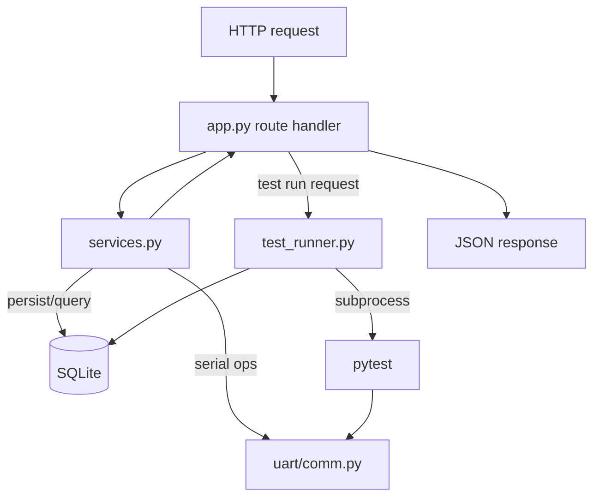
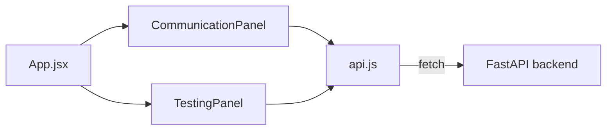
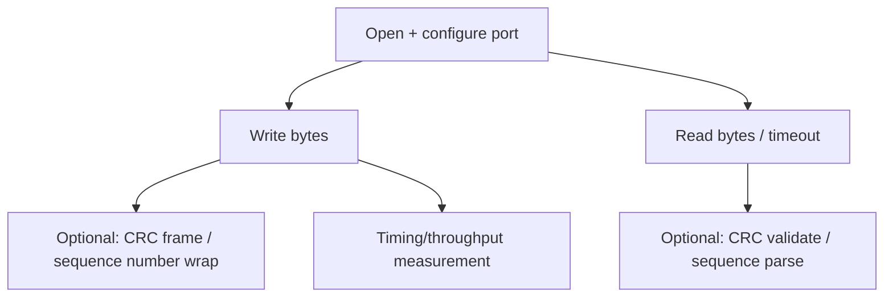

# Low-Level Design (LLD)

## 1. Folder Structure and Purpose

| Folder/File | Purpose |
|---|---|
| `backend/` | FastAPI application: routes, services, models, test orchestration |
| `frontend/` | React + Vite UI |
| `tests/` | Pytest validation suite, grouped by scenario type |
| `uart/` | Reusable UART communication package |
| `pytest.ini` | Pytest configuration (markers such as `hardware`, `slow`; CLI options like `--tx-port`, `--rx-port`, `--soak-seconds`) |
| `requirements.txt` | Python dependencies (FastAPI, Uvicorn, pyserial, pytest, etc.) |
| `run.sh` | Launcher: sets up venv/npm deps and starts backend + frontend together |
| `uart_control_center.db` | SQLite database file |
| `uart_results.csv` | CSV export generated from the database |

## 2. Backend Module Responsibilities

| File | Responsibility (inferred) |
|---|---|
| `app.py` | Declares the FastAPI app instance and all `/api/*` route handlers listed in the API summary; wires requests to `services.py`. |
| `models.py` | Defines request/response schemas (e.g. Pydantic models) and/or SQLite table models for test runs, results, saved profiles, and communication logs. |
| `services.py` | Core business logic: listing serial ports, performing a send/receive communication using `uart/comm.py`, saving/loading test profiles, reading dashboard/history data from SQLite, generating CSV exports. |
| `test_runner.py` | Starts a pytest run (all tests or a selected scenario group) as a background process, tracks its run ID and status, parses pytest output/results, and writes results into SQLite. |

## 3. Backend Flow

## 4. Frontend Flow

- `App.jsx` is the root component and likely owns top-level layout/routing between the Communication, Testing, and Reports views.
- `api.js` centralizes HTTP calls to the backend (base URL from `VITE_API_BASE`, default `http://127.0.0.1:8000/api`).
- `components/CommunicationPanel.jsx` — port selection, data input, send action, and display of received data / errors, backed by `POST /api/communicate` and `GET /api/ports`.
- `components/TestingPanel.jsx` — scenario/profile selection, start-run action, live status polling, and results display, backed by `POST /api/tests/run`, `GET /api/tests/{run_id}`, `GET /api/tests/{run_id}/results`, and the profile endpoints.
- `styles.css` — shared styling for the panels.

## 5. UART Communication Flow (`uart/comm.py`)

Based on the README's listed responsibilities, the module provides:

1. **Port open/configure** — open a serial device with baud rate, data bits, parity, stop bits, and extended options (`xonxoff`, `rtscts`, `dsrdtr`, `exclusive`).
2. **Send/receive** — basic write and read operations with timeout handling.
3. **Duplex exchange** — near-simultaneous send/receive between two open ports.
4. **Chunked transmission** — sending data in pieces (used for inter-byte delay / slow-delivery tests).
5. **Sequence framing** — attaching/parsing sequence numbers for stream-ordering checks.
6. **CRC frame helpers** — building and validating CRC-checked command frames (used by the protocol test group).
7. **Throughput/timing measurement** — timing sends to compute latency and throughput.
8. **Soak-test helpers** — running communication continuously for a configured duration.

This single module is reused both by the pytest suite (`tests/`) and by the backend's live communication endpoint, so behavior tested offline matches behavior exposed through the API.
