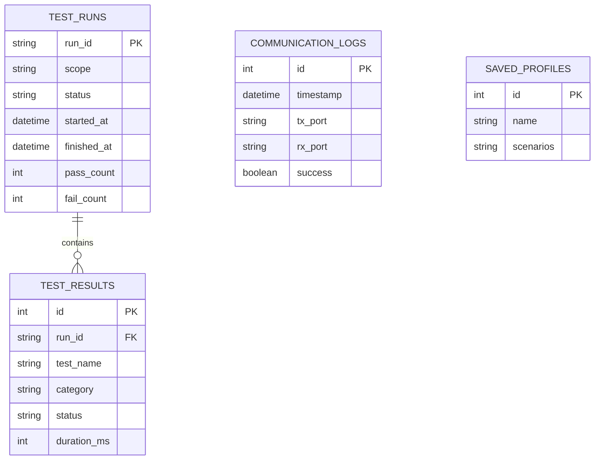

# Database Design

> **Note on accuracy**: The README confirms SQLite (`uart_control_center.db`) stores "test runs, test results, and communication logs," and that saved test profiles exist. Exact column names/types below are **inferred** from what the API and features require — verify against the real schema (e.g. by inspecting `models.py` or the `.db` file) before treating this as authoritative.

## Tables (Inferred)

### `test_runs`
Stores one row per test execution (a click of "run tests").

| Column | Type | Purpose |
|---|---|---|
| `run_id` | TEXT / UUID (PK) | Unique identifier for the run, returned to the frontend for polling |
| `scope` | TEXT | What was run — `all` or a specific scenario group/profile |
| `status` | TEXT | `running`, `completed`, `failed` |
| `started_at` | DATETIME | When the run started |
| `finished_at` | DATETIME (nullable) | When the run finished |
| `pass_count` | INTEGER | Number of passed test cases |
| `fail_count` | INTEGER | Number of failed test cases |

### `test_results`
Stores one row per individual pytest test case within a run.

| Column | Type | Purpose |
|---|---|---|
| `id` | INTEGER (PK) | Row identifier |
| `run_id` | TEXT (FK → `test_runs.run_id`) | Which run this result belongs to |
| `test_name` | TEXT | e.g. `test_basic_send_receive` |
| `category` | TEXT | Scenario group, e.g. `basic`, `protocol`, `stress` |
| `status` | TEXT | `passed`, `failed`, `skipped` |
| `duration_ms` | INTEGER | Execution time |
| `error_message` | TEXT (nullable) | Failure details, if any |

### `communication_logs`
Stores one row per manual send/receive attempt from the Communication panel.

| Column | Type | Purpose |
|---|---|---|
| `id` | INTEGER (PK) | Row identifier |
| `timestamp` | DATETIME | When the communication happened |
| `tx_port` | TEXT | Transmit port used |
| `rx_port` | TEXT | Receive port used |
| `baudrate` | INTEGER | Baud rate used |
| `data_sent` | TEXT | Payload sent |
| `data_received` | TEXT | Payload received |
| `success` | BOOLEAN | Whether sent/received data matched or completed without error |

### `saved_profiles`
Stores user-created custom test profiles (which scenario groups to include).

| Column | Type | Purpose |
|---|---|---|
| `id` | INTEGER (PK) | Row identifier |
| `name` | TEXT | Profile name shown in the UI |
| `scenarios` | TEXT (JSON-encoded list) | Which scenario groups this profile runs |

## Relationships

`communication_logs` and `saved_profiles` are standalone tables with no foreign-key relationship to `test_runs` — communication is independent of automated test execution, and saved profiles are just named scenario-group presets referenced by `scope`/`profile_id` when starting a run.
