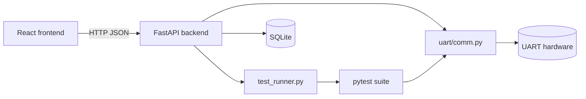

# Technical Report — UART Control Center

## 1. Introduction
UART Control Center is a full-stack tool for validating UART (serial) communication on Raspberry Pi and Linux systems. It brings together a reusable UART library, an automated pytest suite, a FastAPI backend, and a React frontend so that a developer can test real UART hardware without writing one-off scripts each time.

## 2. Problem Statement
Manually testing UART communication is repetitive and error-prone: verifying baud rate compatibility, checking data integrity, measuring timing, and testing failure scenarios (bad ports, disconnects, corrupted frames) typically means writing throwaway scripts each time hardware or requirements change. There was no single, repeatable, hardware-backed way to both validate UART behavior and interact with it live from a UI.

## 3. Solution
The project centralizes all UART logic in one reusable module (`uart/comm.py`) that is shared by both the automated test suite and the live backend API. This means:
- The same tested communication logic backs both "run the validation suite" and "manually send/receive data" — no duplicated or diverging logic.
- A pytest suite (90 cases across 7 categories: basic, configuration, integrity, timing, protocol, negative, stress/soak) can be run directly from the command line or triggered from the web UI.
- A FastAPI backend exposes ports, communication, and test-run control over HTTP, and stores history (runs, results, logs) in SQLite.
- A React frontend provides Communication, Testing, and Reports panels so the whole workflow is usable without the terminal.

## 4. System Architecture
Three tiers: React frontend (Vite dev server) → FastAPI backend → UART hardware + SQLite database. The backend also shells out to pytest (via `test_runner.py`) to run the validation suite and persist results.

## 5. Implementation Summary
- **`uart/comm.py`**: handles port open/config, send/receive, duplex exchange, chunked transmission, sequence framing, CRC frame helpers, throughput/timing measurement, and soak-test helpers.
- **`backend/`**: `app.py` exposes the REST API (health, ports, communicate, test profiles, saved profiles, test run control, history/dashboard, communication logs, CSV export); `services.py` implements the logic behind those routes; `test_runner.py` runs pytest in the background and tracks run status; `models.py` defines the data shapes used across the API and database.
- **`frontend/`**: React app with a Communication panel (manual send/receive), a Testing panel (run all/selected scenario groups, live status), and a Reports view (run history, filtered results).
- **`tests/`**: pytest suite organized into 7 files by category, using markers (`hardware`, `slow`) and CLI options (`--tx-port`, `--rx-port`, `--soak-seconds`) to control execution against real hardware.
- Supports three hardware setups: single-adapter loopback, dual-adapter cross-connect, and USB-to-Pi-GPIO — with hardware-dependent tests (e.g. duplex) auto-skipping when only one endpoint is available (loopback).

## 6. Testing Summary
The suite contains 7 scenario groups and 31 test functions, expanding to 90 total pytest cases (60 of which come from parameterizing `test_uart_configurations` across baud/data-bit/parity/stop-bit combinations). Categories cover:
- **Basic** communication and duplex behavior
- **Configuration** compatibility and mismatch detection
- **Integrity** across large, random, binary, empty, and special-character payloads
- **Timing**: latency, inter-byte delay, timeouts, throughput
- **Protocol**: CRC framing and sequence-number parsing, including invalid/partial frame handling
- **Negative** cases: invalid ports, unsupported config, misuse, disconnects
- **Stress/soak**: continuous streams, bursts, reconnect cycles, and long-duration runs

Tests can run standalone via `pytest` or be triggered through the API, with results persisted to SQLite for later review.

## 7. Challenges Faced
- Designing a UART library that behaves consistently across three different hardware topologies (loopback, dual-adapter, USB+GPIO), including correctly auto-skipping tests that require two independent endpoints when running on loopback.
- Handling Linux/Raspberry Pi serial permission issues (`dialout`/`tty` group membership, UART enablement via `raspi-config`) as a recurring setup obstacle.
- Covering both "happy path" and failure-mode behavior (disconnects, bad CRC, invalid ports) so the suite catches real hardware issues, not just logic bugs.
- Keeping the live backend and the offline test suite behaviorally consistent by sharing the same `uart/comm.py` module rather than duplicating serial logic.

## 8. Results
The result is a working local tool where a developer can start everything with `./run.sh`, send/receive UART data through a browser, run the full 90-case suite (or a subset) against real hardware, and review pass/fail history — with results and logs persisted in SQLite and exportable as CSV.

## 9. Future Improvements
- Add dedicated backend logging instead of console-only output.
- Add database retention/cleanup for old test runs.
- Consider schema migration tooling if the database structure evolves.
- Extend hardware support beyond point-to-point UART (e.g. RS-485 multi-drop) if needed.
- Add containerized deployment for easier setup across different machines.

## 10. Conclusion
UART Control Center demonstrates a practical, hardware-backed approach to UART validation: a single reusable communication layer, a comprehensive pytest suite, and a simple full-stack interface that makes the whole workflow accessible without needing to hand-write scripts for every check. It's a small, focused project that solves a real, repetitive testing problem cleanly.
